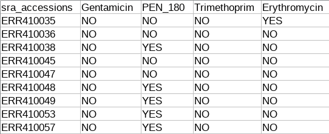

<b> Author: Florian Piewald </b>

<b> Affiliation: Division of Computational Systems Biology (CUBE), University of Vienna </b>

PICA-to-go is a fast machine learning pipeline for the prediction of microbial phenotypes. It clusters all genes using the MMSeqs2 clustering suite and uses these clusters as features for machine learning, which is done by the PICA framework. The pipeline manages to cluster a model for ciprofloxacin resistance in Acinetobacter baumannii in less than 10 minutes on a normal desktop machine with a balanced accuracy of 0.93. Further information is available in Florian Piewalds masters thesis (will be available soon) that was written within implementing this program.

# Installation

The program is currently only available for Linux. There are three possibilies to install PICA-to-go:

## Singularity Container (recommended)

1. Install Singularity (see https://www.sylabs.io/singularity/)
2. Type ``` singularity pull shub://FloFlo93/PICA-to-go:1.0 ``` to download version PICA-to-go 1.0.
3. The Singularity container can be executed as an "ordinary" binary file (e.g. ``` ./FloFlo93-PICA-to-go-master-1.0.simg ``` with all necessary parameters)


## Use the binary release (not recommended)
1. Click on the "releases" button in the Github repository
2. Download the latest release
3. Decompress the file using  ``` tar -xf [filename.tar.xz] ``` (the ```tar``` and ```xz``` package have to be installed)
4. As output, you find a folder called "bin".
5. Change into this folder (``` cd bin/ ```) and call ``` ./pica-to-go ``` with all necessary parameters.
6. The script will automatically detect if a dependency is not installed. In this case, you have to install this dependency manually. While major dependencies are shipped with this release (such as Prodigal, PICA or MMSeqs), the Java virtual machine  (>= 1.8), python2 or the python librarynumpy have to be installed on the system.

## Build PICA-to-go yourself (not recommended)
1. Clone/download the github repository (master branch): ``` git clone https://github.com/FloFlo93/PICA-to-go ```
2. Execute ```./install.sh ```. The install script depends on Maven (make sure Maven is installed). Change into the bin/ folder (```cd bin/```) and execute ```./pica-to-go```. As mentioned before, the script automatically checks if all dependencies are available.

# Usage of the program

## PICA-to-go train

To perform a PICA training, the program needs a directory containing all bins that are used for the training, a phenotyp file (see in the following section), the name of the feature and an output directory (the results will be written to this directory).

```
./pica-to-go train -f CLASS_NAME -i DIR_WITH_BINS -p PHENOTYPE_FILE -o OUTPUT_DIR
```

### Phenotype file

The phenotype file is a tab seperated file containing all information about the affiliation of a bin to a certain phenotype, e.g.

</img>

The name of the bins in the phenotype file has to correspond to the naming used in the directory containing all bins. In case the file suffix is faa, fna, fa or fasta (with or without an additional gz suffix), it is allowed (but not required) to skip the suffix in the phenotype file. For example it is fine if the bin is named ERR410035.fna and in the phenotype file the file is called ERR410035. It is, however, strongly recommended to keep the naming identical.

### Class name
The name of the class corresponds to the name used in the phenotype file.

### DIR_WITH_BINS
A directory containing all training data has to be specified. The files have to be in the fasta format and may not be splitted in sub directories. Protein files and nucleotide files can be used simultaniously as PICA-to-go detects the type of the file automatically. The same is true for gzipped fasta files. Zip archives, on the other hand, cannot be processed.

### OUTPUT directory
Any existing directory that is used to for the output of PICA-to-go.
The program will output the following files:

#### CLASS_NAME.picamodel
This file is a zip archive that is not indended to be read by the user, but contains files that are needed for PICA-to-go predict.


#### CLASS_NAME.rank.raw.tsv
This file contains the output of the feature ranking (importance of each gene cluster for the prediction). The file contains the name of the representative sequence of a cluster (binName^_fastaHeaderIdentifier) and the importance of each gene cluster for the model (value between zero and one).
#### CLASS_NAME.rank.annotated.tsv
As the name of the representative sequence may not be very meaningful, this file contains an additional column with an annotation for each representative sequence (see ...).
#### database.mmseqs
This is a zip archive containing all necessary files of the MMSeqs database, that are needed to run PICA-to-go predict.
#### gene_clusters.json
This is a json representation of all clustered sequences. While the key is the name of the representative sequence, the value contains the names of all genes in this cluster (seperated by whitespace). All names of genes are in the format: binName^_fastaHeaderIdentifier.
#### pica-crossvalidation-no-filtering.json
The accuracy of a model (balanced accuracy, F1 score, raw accuracy, standard deviation) is stated by this file.

### Example
1. Download the Github-Repository.
2. Change in the command-line into the train directory of the example:
```
cd PATH_TO_PICA_TO_GO_ROOT_DIR/example/cipro-res-a-baumannii/train
```
3. Decompress the bins used as training data (make sure that the ```xz``` package is installed too)
```
tar -xf proteins.tar.xz
```
4. Create a folder for the output
```
mkdir output
```
5. Run PICA-to-go train

```
PATH_TO_THE_PICA_TO_GO_EXECUTABLE train -f ciprofloxacin_resistant -i proteins -p ciprofloxacin_Acinetobacter.training.txt -o output
```

6. Inspect the files, after the program is finished. There should be six files:

ciprofloxacin_resistant.picamodel
ciprofloxacin_resistant.rank.annotated.tsv
ciprofloxacin_resistant.rank.raw.tsv
database.mmseqs
gene_clusters.json
pica-crossvalidation-no-filtering.json

The purpose of each file has been stated in the previous section. To get the accuracy of the model, open pica-crossvalidation-no-filtering.json:

less pica-crossvalidation-no-filtering.json

The mean balanced accuracy should be around 0.93. This means that the model is able to classify 93% bins correctly (in case a balanced set of bins is given 50% YES, 50% NO).

### Additional arguments

#### Annotation method
Per default, the fasta headers are used to gain an useful annotation (which is then used for the feature ranking step). In case, only certain fasta files contain annotations, it is possible to specify a list of reference genomes to use. This is done with the -r option.

For example, it would be possible to run the PICA-to-go train example using the following options:

```
PATH_TO_THE_PICA_TO_GO_EXECUTABLE train -f ciprofloxacin_resistant -i proteins -p ciprofloxacin_Acinetobacter.training.txt -o output -r GCA_001441355.1 GCA_001441405.1
```

In this case, not the annotation of the representative sequence of a cluster is used, but every cluster is searched if it contains a gene from these two specified bins (GCA_001441355.1, GCA_001441405.1). The annotation for the gene of the selected bins is then used instead in the feature ranking.

The -r option allows to specify an unlimited number of bins for this purpose.

In case, no annotation is available at all, PICA-to-go offers the possibility to run a remote Blast using the NCBI server. As annotation, the annotation of the top hit is used. This is usually very slow and per default limited to the first ten best features. The behaviour (using annotations from the fasta files or using remote blast) can be changed with the -a option, e.g.

```
PATH_TO_THE_PICA_TO_GO_EXECUTABLE train -f ciprofloxacin_resistant -i proteins -p ciprofloxacin_Acinetobacter.training.txt -o output -a blast
```

The limit of the number of remote Blast searches, can be changed using the -limit_bl option, e.g.
```
PATH_TO_THE_PICA_TO_GO_EXECUTABLE train -f ciprofloxacin_resistant -i proteins -p ciprofloxacin_Acinetobacter.training.txt -o output -a blast -limit_bl 20
```
#### Feature reduction
PICA-to-go offers an option that reduces the number of clusters based on cluster size. The underlying idea behind this is that small clusters may not be as relevant for a prediction than large clusters. To find an optimal cut-off regarding the cluster size, an exhaustive search is performed (PICA crossvalidate.py is executed multiple times to find the cut-off leading to the highest mean balanced accuracy). This step may lead to better results, but can drastically increase the runtime.
A feature reduction is done by adding -filter to the program, e.g.
```
PATH_TO_THE_PICA_TO_GO_EXECUTABLE train -f ciprofloxacin_resistant -i proteins -p ciprofloxacin_Acinetobacter.training.txt -o output -filter
```
#### Number of threads
Per default, PICA-to-go detects the number of available threads on a system and uses them, however it is possible to specify a defined number of threads with -t.
```
PATH_TO_THE_PICA_TO_GO_EXECUTABLE train -f ciprofloxacin_resistant -i proteins -p ciprofloxacin_Acinetobacter.training.txt -o output -t 2
```
#### Temporary directory
Per default, the temporary directory is created in /tmp/, which is often situated in the memory. Therefore, it is highly recommended to define a temporary directory on the harddisk (especially in case of models with a large amount of training data or with limited RAM).

#### Translation table
PICA-to-go uses translation table 11 per default. This case, a different table has to be used, it is possible to change the translation table, e.g.
```
PATH_TO_THE_PICA_TO_GO_EXECUTABLE train -f ciprofloxacin_resistant -i proteins -p ciprofloxacin_Acinetobacter.training.txt -o output -transtable 5
```
(Note: in this case it makes no sense to use translation table 5 and this will lead to potentionally wrong gene predictions).

#### debug option
It is possible to run the program with -d. This leads to the case that the stacktrace is printed and that the temporary directory is not deleted. This is a feature purely used to debug the program in case of an error.


## PICA-to-go predict
The database-archive and the pica model archive of a trained PICA model are needed to perform phenotype predictions. Furthermore, the class name has to be specified as well as an output directory (as in the train mode).

```
./pica-to-go predict -f CLASS_NAME -i DIR_WITH_BINS -m PICA_MODEL -s CLUSTERING_DATABASE -o OUTPUT_DIR
```

### Example
The following steps require that PICA-to-go train has been run on the training set (if not go to the section Usage of the program/PICA-to-go train/Example and perform all steps).

1. Change into the predict subdirectory of the example
```
cd PATH_TO_PICA_TO_GO_ROOT_DIR/example/cipro-res-a-baumannii/predict
```
2. Decompress the bins used as training data (make sure that the ```xz``` package is installed too)
```
tar -xf proteins.tar.xz
```
3. Create a folder for the output
```
mkdir output
```
4. Run PICA-to-go predict

```
PATH_TO_THE_PICA_TO_GO_EXECUTABLE predict -f ciprofloxacin_resistant -i proteins -m ../train/output/ciprofloxacin_resistant.picamodel -s ../train/output/database.mmseqs -o output
```

5. After the PICA-to-go predict run, there should be two files in the output directory. One file is named outputPICA.txt and contains all predictions in a tab seperated way with the first column representing the name of the bin, the second column with the predicted label (YES/NO), while the third column contains a value between zero and one which states the prediction confidence (a value closer to one means that the prediction is more likely). The second file, is a gene_clusters file similar to the one provided after PICA-to-go train, but containing only all newly added sequences to the database mapped to the existing clusters.

### Additional options
PICA-to-go predict provides an option to specify a user defined location for the temporary directory. Furthermore, a translation table can be specified as well as the number of threads. These options are identical to the PICA-to-go train mode.


# Data

## Example data
The program is provided with an example of a model for ciprofloxacin resistance in Acinetobacter baumannii. This model is identical to the model introduced in the corresponding masters thesis to this project. Of the 222 bins, 10 bins were removed from the training to be used for PICA-to-go predict.

## Raw Data
The raw data of all models is available under doc/raw_data.tar.xz. This archive contains the phenotype file for all models. The identifier can be used to download all corresponding genomes. After that, PICA-to-go train can be run on all models in order to reproduce the results used in the corresponding masters thesis. Furthermore, there is a statistics subfolder in the archive that contains all tables/plots used in the masters thesis.
